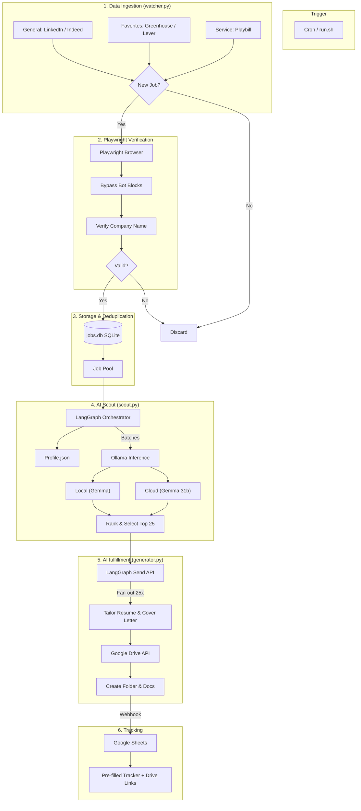

# AI Job Scout System Architecture

The Ava Job Pipeline is an automated discovery, ranking, and tracking system for job opportunities. It leverages browser automation (Playwright) for resilience and LLMs (Ollama) for intelligent ranking.

## System Flow

## Key Components

### 1. Ingestion Layer (`watcher.py`)
- **JobSpy**: Orchestrates search terms across LinkedIn and Indeed.
- **API Clients**: Direct integration with Greenhouse and Lever public APIs.
- **Playwright Subprocess**: Ensures we aren't chasing "ghost" links or mismatched data.

### 2. Intelligence Layer (`scout.py`)
- **LangGraph**: Manages state during the ranking process.
- **Hybrid Inference**:
    - **Cloud**: used for expert-level ranking and complex role alignment.
    - **Local**: used for high-volume initial filtering (latency optimization).

### 3. Persistence Layer (`jobs.db`)
- Tracks unique `job_id` and `link` signatures to ensure Ava never applies to the same job twice.
