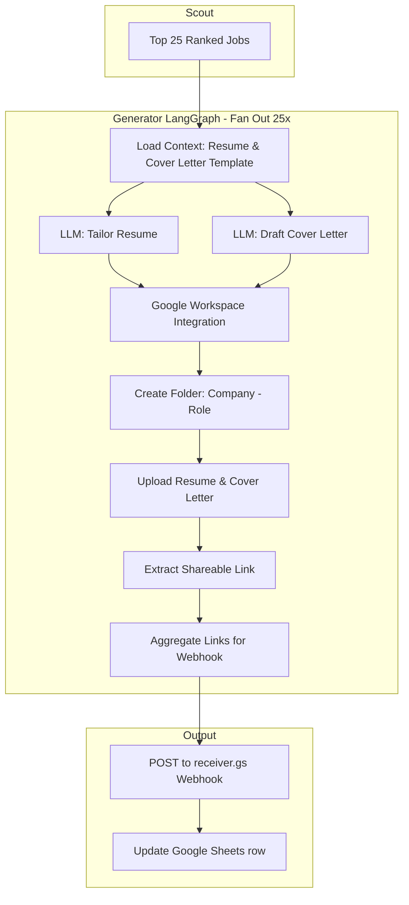

# Spec: Ava Job Document Generator (generator.py)

## Overview
A dedicated LangGraph agent (`generator.py`) responsible for fulfillment in the Ava Job Pipeline. It takes the top 25 ranked jobs from `scout.py`, generates tailored resumes and cover letters for each, creates Google Drive folders containing these documents, and sends the enriched data (including Drive links) to the Google Sheets webhook.

## Architecture & Flow
- **Pipeline Integration**: The execution pipeline in `run.sh` will be updated to: `watcher.py` (Ingest) -> `scout.py` (Rank Top 25) -> `generator.py` (Fulfill) -> Google Sheets Webhook.
- **Concurrency**: `generator.py` will use LangGraph's fan-out capabilities (e.g., `Send` API) to process the 25 jobs concurrently.

## Components

### 1. Document Generation Node
For each job in the top 25:
- **Input Context**: Loads Ava's base resume (`Aschettino, Ava- Resume.docx`) and the cover letter template (`Aschettino, Ava - Cover Letter Template.docx`).
- **Tailor Resume**: Uses the LLM to subtly adjust the resume summary and relevant bullet points to align with the specific job description, strictly maintaining truthfulness.
- **Draft Cover Letter**: Uses the LLM to populate the cover letter template with the target company, role, and a personalized pitch based on Ava's profile and the job requirements.

### 2. Google Workspace Integration Node
Once documents are generated for a job:
- **Authentication**: Authenticates with the Google Drive API (via service account or OAuth credentials).
- **Folder Creation**: Creates a new folder in Google Drive named `[Company] - [Role]`.
- **Document Creation**: Creates two Google Docs within the new folder containing the tailored resume and cover letter.
- **Link Extraction**: Retrieves the shareable link for the newly created folder.

### 3. Webhook Integration Node
- **Aggregation**: Collects the processed jobs, now enriched with their respective Google Drive folder links.
- **Data Transmission**: Sends POST requests to the existing `receiver.gs` webhook.
- **Sheet Update**: The Google Apps Script (`receiver.gs`) will be updated to include a new column for "Drive Folder Link".

## Error Handling
- **Resilience**: The graph will implement robust error handling for each job. If document generation or Google API calls fail (e.g., due to LLM hallucinations, timeouts, or rate limits), the specific job will be caught and skipped for document generation.
- **Graceful Degradation**: Failed jobs will still be sent to the Google Sheets tracker, with the "Drive Folder Link" cell left blank or marked with an error status, ensuring the complete top 25 list is always delivered.

## Future Considerations
- Implement a review node in the document generation phase to double-check for hallucinations or formatting errors before saving to Google Drive.
